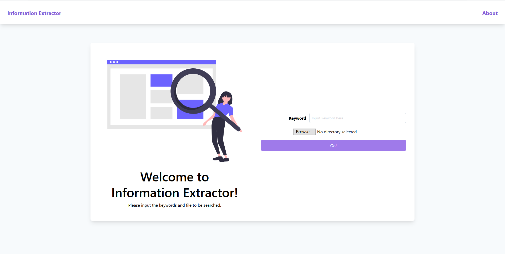
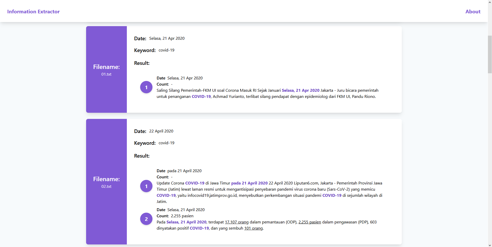

# Information Extractor

> Exteact infromations from articles!

## Prerequisites

- Having Python. This project was developed in Python 3.7.
- Having the `yarn` project manager. Yarn is required in order to install React and run it.
- Having Flask installed on your system. You can easily install Flask using

## Available Scripts

In the project directory, you can run:

### `yarn start`

Ths runs the app in the development mode. 
Open [http://localhost:3000](http://localhost:3000) to view it in the browser.

The page will reload if you make edits. 
You will also see any lint errors in the console.

## Running the project

You need two terminals to run this project.

1. Run the web application by typing `yarn start`.
2. Go to the api directory by `cd api`, then run the Flask app by typing `flask run`.

## Screenshots

